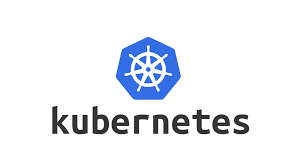

# Test cluster
- Masternode available at : 172.24.1.81
- Helm is installed
- Persistent volumes are tested and can be used.
- Only NodePort service can be used -> ingress controller not yet installed

# kubectl cli tool:
kubectl is installed on the masternode
## using kubectl on your local machine
1. Install kubectl cli tool on your local machine
2. copy the kubeclt config file from the masternode to you own computer
     -> the config file is ->  ~/.kube/config
        this config file contains all the necessary settings and certificates so kubectl can make a connection with the master node.
4. on linux/mac :
   ```
   export KUBECONFIG=/path/to/kubectl/config
   ```
5. option without exporting the KUBECONFIG variable:
   ```
   kubectl --configfile /path/to/kubctl/config <your command>
   ```
